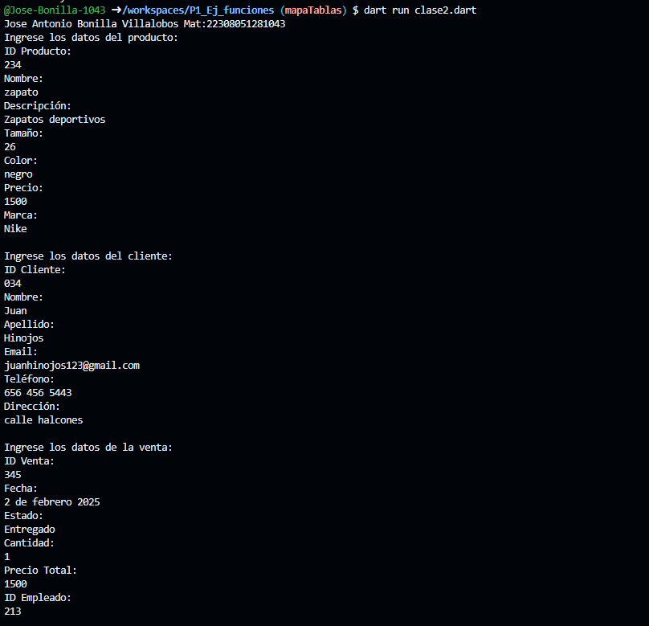
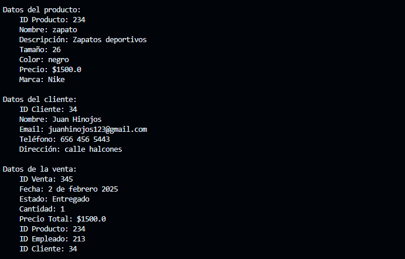

crear una clase Producto con atributos(id_producto,nombre,descripcion,tamaño,color,precio,marca)otra clase de Cliente id_cliente,apellido,email,telefono,direccion
y otra clase venta id_venta,fecha,estado,cantidad,precio_total,id_producto,id_empleado,id_cliente,una funcion captura() desde la interfaz y otra mostrar datos(),crear la instancia y utilizar los atributos y llamadas a funciones lenguaje dart

