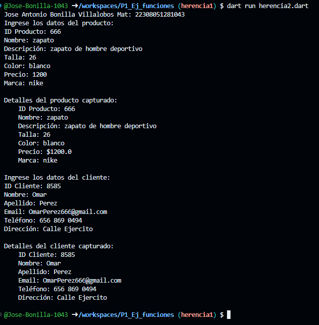

Crear la clase producto con los atributos (id_producto,nombre,descripcion,tamaño,color,precio,marca) con una funcion captura datosProductos()y crear otra tabla cliente (id_cliente,nombre,apellido,email,telefono,direccion con una funcion captura datosCliente(), con interaccion de interfaz de usuario con herencia lenguaje dart

