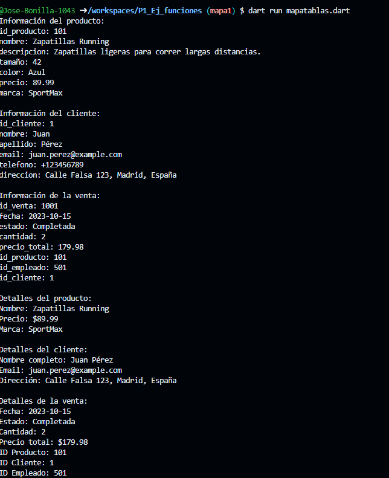

 crear un map <string,dinamic>La tabla Producto id_producto,nombre,descripcion,tamaño,color,precio,marca key value.lenguaje dart

 crear un map <string,dinamic>la tabla cliente, id_cliente,nombre,apellido,email,telefono,direccion

 crear un map <string,dinamic>la tabla venta ,id_venta,fecha,estado,cantidad,precio_total,id_producto,id_empleado,id_cliente

 